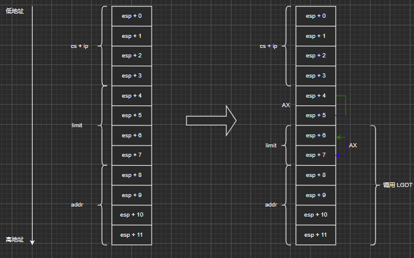

### 写操作系统咯

#### 一些魔数

###### 0x7c00

启动区（boot sector）的装载地址

#### 内存布局

内存的0号地址，也就是最开始的部分，是BIOS程序用来实现各种不同功能的地方，如果我们随便使用的话，就会与BIOS发生冲突，结果不只是BIOS会出错，而且我们的程序也肯定会问题百出。另外，在内存的0xf0000号地址附近，还存放着BIOS程序本身，那里我们也不能使用。

##### 第一天

###### 涉及到的一些术语：

**FAT12格式（FAT12 Format）**

用Windows或MS-DOS格式化出来的软盘就是这种格式。我们的helloos也采用了这种格式，其中容纳了我们开发的操作系统。这个格式兼容性好，在Windows上也能用，而且剩余的磁盘空间还可以用来保存自己喜欢的文件。

**启动区（boot sector）**

软盘第一个的扇区称为启动区。那么什么是扇区呢？<u>计算机读写软盘的时候，并不是一个字节一个字节地读写的，而是以512字节为一个单位进行读写。因此,软盘的512字节就称为一个扇区。</u>一张软盘的空间共有1440KB，也就是1474560字节，除以512得2880，这也就是说一张软盘共有2880个扇区。那为什么第一个扇区称为启动区呢？那是因为计算机首先从最初一个扇区开始读软盘，然后去检查这个扇区最后2个字节的内容。如果这最后2个字节不是0x55 AA，计算机会认为这张盘上没有所需的启动程序，就会报一个不能启动的错误。（也许有人会问为什么一定是0x55 AA呢？那是当初的设计者随便定的，笔者也没法解释）。如果计算机确认了第一个扇区的最后两个字节正好是0x55 AA，那它就认为这个扇区的开头是启动程序，并开始执行这个程序。

###### IPL 

initial program loader的缩写。启动程序加载器。启动区只有区区512字节，实际的操作系统不像hello-os这么小，根本装不进去。所以几乎所有的操作系统，都是把加载操作系统本身的程序放在启动区里的。有鉴于此，有时也将启动区称为IPL。但hello-os没有加载程序的功能，所以HELLOIPL这个名字不太顺理成章。如果有人正义感特别强，觉得“这是撒谎造假，万万不能容忍！”，那也可以改成其他的名字。但是必须起一个8字节的名字，如果名字长度不到8字节的话，需要在最后补上空格。

###### 启动（boot）

boot这个词本是长靴（boots）的单数形式。它与计算机的启动有什么关系呢？一般应该将启动称为start的。实际上，boot这个词是bootstrap的缩写，原指靴子上附带的便于拿取的靴带。但自从有了《吹牛大王历险记》（德国）这个故事以后，bootstrap这个词就有了“自力更生完成任务”这种意思。而且，磁盘上明明装有操作系统，还要说读入操作系统的程序（即IPL）也放在磁盘里，这就像打开宝物箱的钥匙就在宝物箱里一样，是一种矛盾的说法。这种矛盾的操作系统自动启动机制，被称为bootstrap方式。boot这个说法就来源于此。如果是笔者来命名的话，肯定不会用bootstrap 这么奇怪的名字，笔者大概会叫它“多级火箭式”吧。

##### 第二天

**一些寄存器**：

AX——accumulator，累加寄存器

CX——counter，计数寄存器

DX——data，数据寄存器

BX——base，基址寄存器

SP——stack pointer，栈指针寄存器

BP——base pointer，基址指针寄存器

SI——source index，源变址寄存器

DI——destination index，目的变址寄存器

上面的寄存器就是 16 位的 

BP、SP、SI、DI没分为“L”和“H”。

[SI]可以用寄存器来制定内存地址，但可作此用途的寄存器非常有限，只有BX、BP、SI、DI这几个。剩下的AX、CX、DX、SP不能用来指定内存地址。所以想把DX内存里的内容赋值给AL的时候，就会这样写：

```assembly
mov BX,DX
mov AL,[BX]
```

###### BIOS

电脑里有个名为BIOS的程序，出厂时就组装在电脑主板上的ROM2单元里。电脑厂家在BIOS中预先写入了操作系统开发人员经常会用到的一些程序，非常方便。BIOS是英文“basic  input  output  system”的缩写，直译过来就是“基本输入输出系统（程序）”只读存储器，不能写入，切断电源以后内容不会消失。ROM是“read only memory”的缩写。

###### 内存分布图

https://wiki.osdev.org/index.php?title=Memory_Map_%28x86%29&oldid=13415

| start                         | end        | size                                          | type                                 | description                            |
| ----------------------------- | ---------- | --------------------------------------------- | ------------------------------------ | -------------------------------------- |
| Low Memory (the first MiB)    |            |                                               |                                      |                                        |
| 0x00000000                    | 0x000003FF | 1 KiB                                         | RAM - partially unusable (see above) | Real Mode IVT (Interrupt Vector Table) |
| 0x00000400                    | 0x000004FF | 256 bytes                                     | RAM - partially unusable (see above) | BDA (BIOS data area)                   |
| 0x00000500                    | 0x00007BFF | almost 30 KiB                                 | RAM (guaranteed free for use)        | Conventional memory                    |
| 0x00007C00 (typical location) | 0x00007DFF | 512 bytes                                     | RAM - partially unusable (see above) | Your OS BootSector                     |
| 0x00007E00                    | 0x0007FFFF | 480.5 KiB                                     | RAM (guaranteed free for use)        | Conventional memory                    |
| 0x00080000                    | 0x0009FBFF | approximately 120 KiB, depending on EBDA size | RAM (free for use, **if it exists**) | Conventional memory                    |
| 0x0009FC00 (typical location) | 0x0009FFFF | 1 KiB                                         | RAM (unusable)                       | EBDA (Extended BIOS Data Area)         |
| 0x000A0000                    | 0x000FFFFF | 384 KiB                                       | various (unusable)                   | Video memory, ROM Area                 |

##### 第三天

###### INT13

磁盘读、写，扇区校验（verify），以及寻道（seek）

```
AH=0x02;（读盘）
AH=0x03;（写盘）
AH=0x04;（校验）
AH=0x0c;（寻道）
AL=处理对象的扇区数;（只能同时处理连续的扇区）
CH=柱面号 &0xff;
CL=扇区号（0-5位）|（柱面号&0x300）* * 2;
DH=磁头号;
DL=驱动器号；
ES:BX=缓冲地址；(校验及寻道时不使用)
返回值：
FLACS.CF==0：没有错误，AH==0
FLAGS.CF==1：有错误，
错误号码存入AH内（与重置（reset）功能一样）
```

```
Cylinder = 0 to 1023 (maybe 4095), Head = 0 to 15 (maybe 254, maybe 255), Sector = 1 to 63

- Set AH = 2
- AL = total sector count (0 is illegal) -- cannot cross ES page boundary, **or a cylinder boundary**, and must be < 128
- CH = cylinder & 0xff
- CL = Sector | ((cylinder >> 2) & 0xC0);
- DH = Head -- may include two more cylinder bits
- ES:BX -> buffer
- Set DL = "drive number" -- typically 0x80, for the "C" drive
- Issue an INT 0x13.

The carry flag will be set if there is any error during the read. AH should be set to 0 on success.

To write: set AH to 3, instead.

Note: The limitation about not crossing cylinder boundaries is very annoying, especially when combined with the 127 sector limit -- because the arithmetic for the length and "start CHS" of the *next* consecutive read or write gets messy. The simplest workaround is to read or write only one sector at a time in CHS mode. Not all BIOSes have these two limitations, of course, but it is necessary to program for the "lowest common denominator".
```

###### 软盘

1张软盘有80个柱面，2个磁头，18个扇区，且一个扇区有512字节。所以，一张软盘的容量是：80×2×18×512 = 1 474 560 Byte = 1 440KB

含有IPL的启动区，位于C0-H0-S1（柱面0，磁头0，扇区1的缩写）.

下一个扇区是C0-H0-S2。这次我们想要装载的就是这个扇区。

C0-H0-S18 的下一扇区是 C0-H1-S1

###### haribote.img

在0x002600附近，磁盘的这个位置好像保存着文件名

0x004200那里，可以看到“F4 EB FD”

F4 EB FD 即为 

```assembly
fin:
    HLT
    JMP     fin
```

所生成的二进制

###### 从启动区执行操作系统

要怎样才能执行磁盘映像上位于0x004200号地址的程序呢？现在的程序是从启动区开始，把磁盘上的内容装载到内存0x8000号地址，所以磁盘0x4200处的内容就应该位于内存0x8000+0x4200=0xc200号地址。这样的话，我们就往haribote.nas里加上ORG 0xc200，然后在ipl.nas处理的最后加上JMP0xc200这个指令。

> 其实是将磁盘的第2扇区一直到第 360 扇区的读取到了 0x8200~。可以视作将第1扇区读到了 0x8000，虽然并没有读取第一扇区的内容。

###### org 指令

汇编伪指令ORG作用是定义程序或数据块的起始地址，指示此语句后面的程序或数据块以nn为起始地址连续存放在程序存储器中。

ORG是Origin的缩写：起始地址，源。在汇编语言源程序的开始通常都用一条ORG伪指令来实现规定程序的起始地址。如果不用ORG规定则汇编得到的目标程序将从0000H开始。

ORG数值表达式伪指令的作用是：告诉汇编程序，本伪指令下面的内存变量从该“数值表达式”所指定的地址开始分配。汇编语言提供了一个特殊的符号“$”来引用偏移量计数器的值。

org 并不是说程序真的被加载到这个地址了，而是让程序自以为被加载到这个地址了。

###### INT10

```
设置显卡模式（video mode）

AH=0x00;

AL=模式：（省略了一些不重要的画面模式）

​	0x03：16色字符模式，80 × 25

​	0x12：VGA 图形模式，640 × 480 × 4位彩色模式，独特的4面存储模式

​	0x13：VGA 图形模式，320 × 200 × 8位彩色模式，调色板模式

​	0x6a：扩展VGA 图形模式，800 × 600 × 4位彩色模式，独特的4面存储模式（有的显卡不支持这个模式）

返回值：无
```

###### 32位模式前期准备

如果用32位模式就不能调用BIOS功能了。这是因为BIOS是用16位机器语言写的。<u>如果我们有什么事情想用BIOS来做，那就全部都放在开头先做</u>，因为一旦进入32位模式就不能调用BIOS函数了。（当然，也有从32位返回到16位的方法，但是非常费工夫，所以本书不予赘述。）再回头说说要使用BIOS做的事情。画面模式的设定已经做完了，接下来还想从BIOS得到键盘状态。所谓键盘状态，是指NumLock是ON还是OFF等这些状态。

###### INT16 AH=2

```
AH = 02h
Return:AL = shift flags (see #00582)
AH destroyed by many BIOSes
```

```
Bitfields for keyboard shift flags:

Bit(s)  Description     (Table 00582)
7      Insert active
6      CapsLock active
5      NumLock active
4      ScrollLock active
3      Alt key pressed (either Alt on 101/102-key keyboards)
2      Ctrl key pressed (either Ctrl on 101/102-key keyboards)
1      left shift key pressed
0      right shift key pressed
```

###### 导入 c 语言

这个bootpack.c是怎样变成机器语言的呢？如果不能变成机器语言，就是说得再多也没有意义。这个步骤很长，让我们看一看。

```
首先，使用cc1.exe从bootpack.c生成bootpack.gas。

第二步，使用gas2nask.exe从bootpack.gas生成bootpack.nas。

第三步，使用nask.exe从bootpack.nas生成bootpack.obj。

第四步，使用obi2bim.exe从bootpack.obj生成bootpack.bim。

最后，使用bim2hrb.exe从bootpack.bim生成bootpack.hrb。这样就做成了机器语言，再使用copy指令将asmhead.bin与bootpack.hrb单纯结合到起来，就成了haribote.sys。
```

##### 第四天

###### instrset

它是用来告诉nask“这个程序是给486用的哦”，nask见了这一行之后就知道“哦，那见了EAX这个词，就解释成寄存器名”。如果什么都不指定，它就会认为那是为8086这种非常古老的、而且只有16位寄存器的CPU而写的程序，见了EAX这个词，会误解成标签（Label），或是常数。8086那时候写的程序中，曾偶尔使用EAX来做标签，当时也没想到这个单词后来会成为寄存器名而不能再随便使用。

###### 色号设定

这次使用的是320×   200的8位颜色模式，色号使用8位（二进制）数，也就是只能使用0～255的数。

仅使用这几个颜色

```
#000000:黑
#00ffff:浅亮蓝
#000084:暗蓝
#ff0000:亮红
#ffffff:白
#840084:暗紫
#00ff00:亮绿
#c6c6c6:亮灰
#008484:浅暗蓝
#ffff00:亮黄
#840000:暗红
#848484:暗灰
#0000ff:亮蓝
#008400:暗绿
#ff00ff:亮紫
#848400:暗黄
```

###### IN/OUT

CPU的管脚与内存相连。如果仅仅是与内存相连，CPU就只能完成计算和存储的功能。但实际上，CPU还要对键盘的输入有响应，要通过网卡从网络取得信息，通过声卡发送音乐数据，向软盘写入信息等。这些都是设备（device），它们当然也都要连接到CPU上。既然CPU与设备相连，那么就有向这些设备发送电信号，或者从这些设备取得信息的指令。向设备发送电信号的是OUT指令；从设备取得电气信号的是IN指令。正如为了区别不同的内存要使用内存地址一样，在OUT指令和IN指令中，为了区别不同的设备，也要使用设备号码。设备号码在英文中称为port（端口）。port原意为“港口”，这里形象地将CPU与各个设备交换电信号的行为比作了船舶的出港和进港。

###### 设置调色板

调色板的访问步骤。首先在一连串的访问中屏蔽中断（比如CLI）。将想要设定的调色板号码写入0x03c8，紧接着，按R，G，B的顺序写入0x03c9。如果还想继续设定下一个调色板，则省略调色板号码，再按照RGB的顺序写入0x03c9就行了。如果想要读出当前调色板的状态，首先要将调色板的号码写入0x03c7，再从0x03c9读取3次。读出的顺序就是R，G，B。如果要继续读出下一个调色板，同样也是省略调色板号码的设定，按RGB的顺序读出。如果最初执行了CLI，那么最后要执行STI

###### CLI/STI

首先是CLI和STI。所谓CLI，是将中断标志（interrupt  flag）置为0的指令（clear  interrupt  flag）。STI是要将这个中断标志置为1的指令（setinterrupt   flag）。

更改中断标志有什么好处呢？正如其名所示，它与CPU的中断处理有关系。当CPU遇到中断请求时，是立即处理中断请求（中断标志为1），还是忽略中断请求（中断标志为0），就由这个中断标志位来设定。

###### EFLAGS

下面再来介绍一下EFLAGS这一特别的寄存器。这是由名为FLAGS的16位寄存器扩展而来的32位寄存器。FLAGS是存储进位标志和中断标志等标志的寄存器。进位标志可以通过JC或JNC等跳转指令来简单地判断到

底是0还是1。但对于中断标志，没有类似的JI或JNI命令，所以只能读入EFLAGS，再检查第9位是0还是1。顺便说一下，进位标志是EFLAGS的第0位。空白位没有特殊意义（或许留给将来的CPU用？）set_palette中想要做的事情是在设定调色板之前首先执行CLI，但处理结束以后一定要恢复中断标志，因此需要记住最开始的中断标志是什么。所以我们制作了一个函数io_load_eflags，读取最初的eflags值。处理结束以后，可以先看看eflags的内容，再决定是否执行STI，但仔细想一想，也没必要搞得那么复杂，干脆将eflags的值代入EFLAGS，中断标志位就恢复为原来的值了。函数o_store_eflags就是完成这个处理的。估计不说大家也知道了，CLI也好，STI也好，EFLAGS的读取也好，EFLAGS的写入也好，都不能用C语言来完成。所以我们就努力一下，用汇编语言来写吧。

##### 第五天

###### char 和 unsigned char 进行位运算的一个坑

```c
int main() {
    char flag = (char) 0x80;
    for (int i = 0; i < 8; ++i) {
        printf("%x\n", flag);
        flag >>= 1;
    }
    printf("============\n");
    unsigned char uFlag = 0x80;
    for (int i = 0; i < 8; ++i) {
        printf("%x\n", uFlag);
        uFlag >>= 1;
    }
}
```

输出：

```
ffffff80
ffffffc0
ffffffe0
fffffff0
fffffff8
fffffffc
fffffffe
ffffffff
============
80
40
20
10
8
4
2
1
```

所以，进行位运算时用 unsigned char。

###### GDT与IDT的初始化

GDT也好，IDT也好，它们都是与CPU有关的设定。为了让操作系统能够使用32位模式，需要对CPU做各种设定。

###### 分段

可以将内存分成多个段，每个段可以视作一段独立的内存空间。代码的地址是相对于该段的地址而言。

> 需要注意的一点是，我们用16位的时候曾经讲解过的段寄存器。这里的分段，使用的就是这个段寄存器。但是16位的时候，如果计算地址，只要将地址乘以16就可以了。但现在已经是32位了，不能再这么用了。如果写成“MOV    AL,[DS:EBX]”，CPU会往EBX里加上某个值来计算地址，这个值不是DS的16倍，而是DS所表示的段的起始地址。即使省略段寄存器（segment  register）的地址，也会自动认为是指定了DS。这个规则不管是16位模式还是32位模式，都是一样的。

段的信息

按这种分段方法，为了表示一个段，需要有以下信息。

+ 段的大小是多少

+ 段的起始地址在哪里

+ 段的管理属性（禁止写入，禁止执行，系统专用等）

CPU用8个字节（=64位）的数据来表示这些信息。但是，用于指定段的寄存器只有16位。或许有人会猜想在32位模式下，段寄存器会扩展到64位，但事实上段寄存器仍然是16位。

###### GDT

在调色板后，我们可以设置色号表，在表中记录每一个色号所代表的颜色。但是色号只能是 0~255的数。

同理，也有一个段号表，段号可以用0~8191（6 * 1024）的数。因为段寄存器是16位，所以本来应该能够处理0~65535范围的数，但由于CPU设计上的原因，段寄存器的低3位不能使用。因此能够使用的段号只有13位，能够处理的就只有位于0~8191的区域了。

但因为能够使用0~8191的范围，即可以定义8192个段，所以设定这么多段就需要8192×8=65  536字节（64KB）。

###### GDT （global（segment）descriptor  table）

GDT是“global（segment）descriptor  table”的缩写，意思是全局段号记录表。将这些数据整齐地排列在内存的某个地方，然后将内存的起始地址和有效设定个数放在CPU内被称作GDTR5的特殊寄存器中，设定就完成了。

###### IDT （interrupt descriptor table）

另外，IDT是“interrupt descriptor table”的缩写，直译过来就是“中断记录表”。当CPU遇到外部状况变化，或者是内部偶然发生某些错误时，会临时切换过去处理这种突发事件。这就是中断功能。

要使用鼠标，就必须要使用中断。所以，我们必须设定IDT。IDT记录了0～255的中断号码与调用函数的对应关系，比如说发生了123号中断，就调用○×函数，其设定方法与GDT很相似（或许是因为使用同样的方法能简化CPU的电路）。

如果段的设定还没顺利完成就设定IDT的话，会比较麻烦，所以必须先进行GDT的设定。

##### 第六天

###### load_gdtr 和 load_idtr 的解读

```assembly
_load_gdtr: ; void load_gdtr(int limit,int addr)    segment descriptor
    MOV     AX,[ESP+4]      ; limit
    MOV     [ESP+6],AX      ; todo ???
    LGDT    [ESP+6]
    RET


_load_idtr: ; void load_idtr(int limit,int addr)    interrupt descriptor
    MOV		AX,[ESP+4]		; limit
    MOV		[ESP+6],AX      ; todo ???
    LIDT	[ESP+6]
    RET
```

先看 load_gdtr。这个函数用来将指定的段上限（limit）和地址值赋值给名为GDTR的48位寄存器。这是一个很特别的48位寄存器，并不能用我们常用的MOV指令来赋值。给它赋值的时候，唯一的方法就是指定一个内存地址，从指定的地址读取6个字节（也就是48位），然后赋值给GDTR寄存器。完成这一任务的指令，就是LGDT。

该寄存器的低16位1（即内存的最初2个字节）是段上限，它等于“GDT的有效字节数  -  1”。今后我们还会偶尔用到上限这个词，意思都是表示量的大小，一般为“字节数  -  1”。剩下的高32位（即剩余的4个字节），代表GDT的开始地址。



```drawio
<mxfile>
    <diagram id="cE5uHtphANISIs85Q7SA" name="第 1 页">
        <mxGraphModel dx="848" dy="611" grid="1" gridSize="10" guides="1" tooltips="1" connect="1" arrows="1" fold="1" page="1" pageScale="1" pageWidth="3300" pageHeight="4681" math="0" shadow="0">
            <root>
                <mxCell id="0"/>
                <mxCell id="1" parent="0"/>
                <mxCell id="32" value="" style="rounded=0;whiteSpace=wrap;html=1;" parent="1" vertex="1">
                    <mxGeometry x="280" y="440" width="80" height="480" as="geometry"/>
                </mxCell>
                <mxCell id="33" value="" style="endArrow=classic;html=1;" parent="1" edge="1">
                    <mxGeometry width="50" height="50" relative="1" as="geometry">
                        <mxPoint x="120" y="440" as="sourcePoint"/>
                        <mxPoint x="120" y="920" as="targetPoint"/>
                    </mxGeometry>
                </mxCell>
                <mxCell id="34" value="低地址" style="text;html=1;align=center;verticalAlign=middle;resizable=0;points=[];autosize=1;" parent="1" vertex="1">
                    <mxGeometry x="60" y="440" width="50" height="20" as="geometry"/>
                </mxCell>
                <mxCell id="35" value="高地址" style="text;html=1;align=center;verticalAlign=middle;resizable=0;points=[];autosize=1;" parent="1" vertex="1">
                    <mxGeometry x="60" y="900" width="50" height="20" as="geometry"/>
                </mxCell>
                <mxCell id="40" value="" style="endArrow=none;html=1;exitX=-0.002;exitY=0.083;exitDx=0;exitDy=0;exitPerimeter=0;" parent="1" source="32" edge="1">
                    <mxGeometry width="50" height="50" relative="1" as="geometry">
                        <mxPoint x="440" y="520" as="sourcePoint"/>
                        <mxPoint x="360" y="480" as="targetPoint"/>
                    </mxGeometry>
                </mxCell>
                <mxCell id="41" value="" style="endArrow=none;html=1;exitX=-0.002;exitY=0.083;exitDx=0;exitDy=0;exitPerimeter=0;" parent="1" edge="1">
                    <mxGeometry width="50" height="50" relative="1" as="geometry">
                        <mxPoint x="279.84000000000003" y="520" as="sourcePoint"/>
                        <mxPoint x="360" y="520.16" as="targetPoint"/>
                    </mxGeometry>
                </mxCell>
                <mxCell id="42" value="" style="endArrow=none;html=1;exitX=-0.002;exitY=0.083;exitDx=0;exitDy=0;exitPerimeter=0;" parent="1" edge="1">
                    <mxGeometry width="50" height="50" relative="1" as="geometry">
                        <mxPoint x="280" y="560" as="sourcePoint"/>
                        <mxPoint x="360.15999999999997" y="560.16" as="targetPoint"/>
                    </mxGeometry>
                </mxCell>
                <mxCell id="43" value="" style="endArrow=none;html=1;exitX=-0.002;exitY=0.083;exitDx=0;exitDy=0;exitPerimeter=0;" parent="1" edge="1">
                    <mxGeometry width="50" height="50" relative="1" as="geometry">
                        <mxPoint x="279.84000000000003" y="600" as="sourcePoint"/>
                        <mxPoint x="360" y="600.16" as="targetPoint"/>
                    </mxGeometry>
                </mxCell>
                <mxCell id="44" value="" style="endArrow=none;html=1;exitX=-0.002;exitY=0.083;exitDx=0;exitDy=0;exitPerimeter=0;" parent="1" edge="1">
                    <mxGeometry width="50" height="50" relative="1" as="geometry">
                        <mxPoint x="279.84000000000003" y="640" as="sourcePoint"/>
                        <mxPoint x="360" y="640.16" as="targetPoint"/>
                    </mxGeometry>
                </mxCell>
                <mxCell id="45" value="" style="endArrow=none;html=1;exitX=-0.002;exitY=0.083;exitDx=0;exitDy=0;exitPerimeter=0;" parent="1" edge="1">
                    <mxGeometry width="50" height="50" relative="1" as="geometry">
                        <mxPoint x="280" y="679.5" as="sourcePoint"/>
                        <mxPoint x="360.15999999999997" y="679.66" as="targetPoint"/>
                    </mxGeometry>
                </mxCell>
                <mxCell id="46" value="" style="endArrow=none;html=1;exitX=-0.002;exitY=0.083;exitDx=0;exitDy=0;exitPerimeter=0;" parent="1" edge="1">
                    <mxGeometry width="50" height="50" relative="1" as="geometry">
                        <mxPoint x="279.84000000000003" y="720" as="sourcePoint"/>
                        <mxPoint x="360" y="720.16" as="targetPoint"/>
                    </mxGeometry>
                </mxCell>
                <mxCell id="47" value="" style="endArrow=none;html=1;exitX=-0.002;exitY=0.083;exitDx=0;exitDy=0;exitPerimeter=0;" parent="1" edge="1">
                    <mxGeometry width="50" height="50" relative="1" as="geometry">
                        <mxPoint x="279.84000000000003" y="760" as="sourcePoint"/>
                        <mxPoint x="360" y="760.16" as="targetPoint"/>
                    </mxGeometry>
                </mxCell>
                <mxCell id="48" value="" style="endArrow=none;html=1;exitX=-0.002;exitY=0.083;exitDx=0;exitDy=0;exitPerimeter=0;" parent="1" edge="1">
                    <mxGeometry width="50" height="50" relative="1" as="geometry">
                        <mxPoint x="280" y="800" as="sourcePoint"/>
                        <mxPoint x="360.15999999999997" y="800.16" as="targetPoint"/>
                    </mxGeometry>
                </mxCell>
                <mxCell id="49" value="" style="endArrow=none;html=1;exitX=-0.002;exitY=0.083;exitDx=0;exitDy=0;exitPerimeter=0;" parent="1" edge="1">
                    <mxGeometry width="50" height="50" relative="1" as="geometry">
                        <mxPoint x="279.84" y="840" as="sourcePoint"/>
                        <mxPoint x="359.99999999999994" y="840.16" as="targetPoint"/>
                    </mxGeometry>
                </mxCell>
                <mxCell id="50" value="" style="endArrow=none;html=1;exitX=-0.002;exitY=0.083;exitDx=0;exitDy=0;exitPerimeter=0;" parent="1" edge="1">
                    <mxGeometry width="50" height="50" relative="1" as="geometry">
                        <mxPoint x="279.84000000000003" y="880" as="sourcePoint"/>
                        <mxPoint x="360" y="880.1600000000001" as="targetPoint"/>
                    </mxGeometry>
                </mxCell>
                <mxCell id="51" value="esp + 0" style="text;html=1;align=center;verticalAlign=middle;resizable=0;points=[];autosize=1;" parent="1" vertex="1">
                    <mxGeometry x="290" y="450" width="60" height="20" as="geometry"/>
                </mxCell>
                <mxCell id="53" value="esp + 1" style="text;html=1;align=center;verticalAlign=middle;resizable=0;points=[];autosize=1;" parent="1" vertex="1">
                    <mxGeometry x="290" y="490" width="60" height="20" as="geometry"/>
                </mxCell>
                <mxCell id="54" value="esp + 2" style="text;html=1;align=center;verticalAlign=middle;resizable=0;points=[];autosize=1;" parent="1" vertex="1">
                    <mxGeometry x="290" y="530" width="60" height="20" as="geometry"/>
                </mxCell>
                <mxCell id="55" value="esp + 3" style="text;html=1;align=center;verticalAlign=middle;resizable=0;points=[];autosize=1;" parent="1" vertex="1">
                    <mxGeometry x="290" y="570" width="60" height="20" as="geometry"/>
                </mxCell>
                <mxCell id="56" value="esp + 4" style="text;html=1;align=center;verticalAlign=middle;resizable=0;points=[];autosize=1;" parent="1" vertex="1">
                    <mxGeometry x="290" y="610" width="60" height="20" as="geometry"/>
                </mxCell>
                <mxCell id="57" value="esp + 5" style="text;html=1;align=center;verticalAlign=middle;resizable=0;points=[];autosize=1;" parent="1" vertex="1">
                    <mxGeometry x="290" y="650" width="60" height="20" as="geometry"/>
                </mxCell>
                <mxCell id="58" value="esp + 6" style="text;html=1;align=center;verticalAlign=middle;resizable=0;points=[];autosize=1;" parent="1" vertex="1">
                    <mxGeometry x="290" y="690" width="60" height="20" as="geometry"/>
                </mxCell>
                <mxCell id="59" value="esp + 7" style="text;html=1;align=center;verticalAlign=middle;resizable=0;points=[];autosize=1;" parent="1" vertex="1">
                    <mxGeometry x="290" y="730" width="60" height="20" as="geometry"/>
                </mxCell>
                <mxCell id="60" value="esp + 8" style="text;html=1;align=center;verticalAlign=middle;resizable=0;points=[];autosize=1;" parent="1" vertex="1">
                    <mxGeometry x="290" y="770" width="60" height="20" as="geometry"/>
                </mxCell>
                <mxCell id="61" value="esp + 9" style="text;html=1;align=center;verticalAlign=middle;resizable=0;points=[];autosize=1;" parent="1" vertex="1">
                    <mxGeometry x="290" y="810" width="60" height="20" as="geometry"/>
                </mxCell>
                <mxCell id="62" value="esp + 10" style="text;html=1;align=center;verticalAlign=middle;resizable=0;points=[];autosize=1;" parent="1" vertex="1">
                    <mxGeometry x="285" y="850" width="70" height="20" as="geometry"/>
                </mxCell>
                <mxCell id="63" value="esp + 11" style="text;html=1;align=center;verticalAlign=middle;resizable=0;points=[];autosize=1;" parent="1" vertex="1">
                    <mxGeometry x="285" y="890" width="70" height="20" as="geometry"/>
                </mxCell>
                <mxCell id="67" value="" style="shape=curlyBracket;whiteSpace=wrap;html=1;rounded=1;" parent="1" vertex="1">
                    <mxGeometry x="250" y="440" width="20" height="160" as="geometry"/>
                </mxCell>
                <mxCell id="68" value="" style="shape=curlyBracket;whiteSpace=wrap;html=1;rounded=1;" parent="1" vertex="1">
                    <mxGeometry x="250" y="600" width="20" height="160" as="geometry"/>
                </mxCell>
                <mxCell id="69" value="" style="shape=curlyBracket;whiteSpace=wrap;html=1;rounded=1;" parent="1" vertex="1">
                    <mxGeometry x="250" y="760" width="20" height="160" as="geometry"/>
                </mxCell>
                <mxCell id="70" value="cs + ip" style="text;html=1;align=center;verticalAlign=middle;resizable=0;points=[];autosize=1;" vertex="1" parent="1">
                    <mxGeometry x="190" y="510" width="50" height="20" as="geometry"/>
                </mxCell>
                <mxCell id="71" value="limit" style="text;html=1;align=center;verticalAlign=middle;resizable=0;points=[];autosize=1;" vertex="1" parent="1">
                    <mxGeometry x="190" y="670" width="40" height="20" as="geometry"/>
                </mxCell>
                <mxCell id="72" value="addr" style="text;html=1;align=center;verticalAlign=middle;resizable=0;points=[];autosize=1;" vertex="1" parent="1">
                    <mxGeometry x="190" y="830" width="40" height="20" as="geometry"/>
                </mxCell>
                <mxCell id="73" value="" style="shape=singleArrow;whiteSpace=wrap;html=1;" vertex="1" parent="1">
                    <mxGeometry x="430" y="640" width="100" height="60" as="geometry"/>
                </mxCell>
                <mxCell id="74" value="" style="rounded=0;whiteSpace=wrap;html=1;" vertex="1" parent="1">
                    <mxGeometry x="650" y="440" width="80" height="480" as="geometry"/>
                </mxCell>
                <mxCell id="75" value="" style="endArrow=none;html=1;exitX=-0.002;exitY=0.083;exitDx=0;exitDy=0;exitPerimeter=0;" edge="1" parent="1" source="74">
                    <mxGeometry width="50" height="50" relative="1" as="geometry">
                        <mxPoint x="810" y="520" as="sourcePoint"/>
                        <mxPoint x="730" y="480" as="targetPoint"/>
                    </mxGeometry>
                </mxCell>
                <mxCell id="76" value="" style="endArrow=none;html=1;exitX=-0.002;exitY=0.083;exitDx=0;exitDy=0;exitPerimeter=0;" edge="1" parent="1">
                    <mxGeometry width="50" height="50" relative="1" as="geometry">
                        <mxPoint x="649.84" y="520" as="sourcePoint"/>
                        <mxPoint x="730" y="520.1599999999999" as="targetPoint"/>
                    </mxGeometry>
                </mxCell>
                <mxCell id="77" value="" style="endArrow=none;html=1;exitX=-0.002;exitY=0.083;exitDx=0;exitDy=0;exitPerimeter=0;" edge="1" parent="1">
                    <mxGeometry width="50" height="50" relative="1" as="geometry">
                        <mxPoint x="650" y="560" as="sourcePoint"/>
                        <mxPoint x="730.1599999999999" y="560.1599999999999" as="targetPoint"/>
                    </mxGeometry>
                </mxCell>
                <mxCell id="78" value="" style="endArrow=none;html=1;exitX=-0.002;exitY=0.083;exitDx=0;exitDy=0;exitPerimeter=0;" edge="1" parent="1">
                    <mxGeometry width="50" height="50" relative="1" as="geometry">
                        <mxPoint x="649.84" y="600" as="sourcePoint"/>
                        <mxPoint x="730" y="600.1599999999999" as="targetPoint"/>
                    </mxGeometry>
                </mxCell>
                <mxCell id="79" value="" style="endArrow=none;html=1;exitX=-0.002;exitY=0.083;exitDx=0;exitDy=0;exitPerimeter=0;" edge="1" parent="1">
                    <mxGeometry width="50" height="50" relative="1" as="geometry">
                        <mxPoint x="649.84" y="640" as="sourcePoint"/>
                        <mxPoint x="730" y="640.1599999999999" as="targetPoint"/>
                    </mxGeometry>
                </mxCell>
                <mxCell id="80" value="" style="endArrow=none;html=1;exitX=-0.002;exitY=0.083;exitDx=0;exitDy=0;exitPerimeter=0;" edge="1" parent="1">
                    <mxGeometry width="50" height="50" relative="1" as="geometry">
                        <mxPoint x="650" y="679.5" as="sourcePoint"/>
                        <mxPoint x="730.1599999999999" y="679.6599999999999" as="targetPoint"/>
                    </mxGeometry>
                </mxCell>
                <mxCell id="81" value="" style="endArrow=none;html=1;exitX=-0.002;exitY=0.083;exitDx=0;exitDy=0;exitPerimeter=0;" edge="1" parent="1">
                    <mxGeometry width="50" height="50" relative="1" as="geometry">
                        <mxPoint x="649.84" y="720" as="sourcePoint"/>
                        <mxPoint x="730" y="720.1599999999999" as="targetPoint"/>
                    </mxGeometry>
                </mxCell>
                <mxCell id="82" value="" style="endArrow=none;html=1;exitX=-0.002;exitY=0.083;exitDx=0;exitDy=0;exitPerimeter=0;" edge="1" parent="1">
                    <mxGeometry width="50" height="50" relative="1" as="geometry">
                        <mxPoint x="649.84" y="760" as="sourcePoint"/>
                        <mxPoint x="730" y="760.1599999999999" as="targetPoint"/>
                    </mxGeometry>
                </mxCell>
                <mxCell id="83" value="" style="endArrow=none;html=1;exitX=-0.002;exitY=0.083;exitDx=0;exitDy=0;exitPerimeter=0;" edge="1" parent="1">
                    <mxGeometry width="50" height="50" relative="1" as="geometry">
                        <mxPoint x="650" y="800" as="sourcePoint"/>
                        <mxPoint x="730.1599999999999" y="800.1599999999999" as="targetPoint"/>
                    </mxGeometry>
                </mxCell>
                <mxCell id="84" value="" style="endArrow=none;html=1;exitX=-0.002;exitY=0.083;exitDx=0;exitDy=0;exitPerimeter=0;" edge="1" parent="1">
                    <mxGeometry width="50" height="50" relative="1" as="geometry">
                        <mxPoint x="649.8399999999999" y="840" as="sourcePoint"/>
                        <mxPoint x="730" y="840.1599999999999" as="targetPoint"/>
                    </mxGeometry>
                </mxCell>
                <mxCell id="85" value="" style="endArrow=none;html=1;exitX=-0.002;exitY=0.083;exitDx=0;exitDy=0;exitPerimeter=0;" edge="1" parent="1">
                    <mxGeometry width="50" height="50" relative="1" as="geometry">
                        <mxPoint x="649.84" y="880" as="sourcePoint"/>
                        <mxPoint x="730" y="880.1600000000001" as="targetPoint"/>
                    </mxGeometry>
                </mxCell>
                <mxCell id="86" value="esp + 0" style="text;html=1;align=center;verticalAlign=middle;resizable=0;points=[];autosize=1;" vertex="1" parent="1">
                    <mxGeometry x="660" y="450" width="60" height="20" as="geometry"/>
                </mxCell>
                <mxCell id="87" value="esp + 1" style="text;html=1;align=center;verticalAlign=middle;resizable=0;points=[];autosize=1;" vertex="1" parent="1">
                    <mxGeometry x="660" y="490" width="60" height="20" as="geometry"/>
                </mxCell>
                <mxCell id="88" value="esp + 2" style="text;html=1;align=center;verticalAlign=middle;resizable=0;points=[];autosize=1;" vertex="1" parent="1">
                    <mxGeometry x="660" y="530" width="60" height="20" as="geometry"/>
                </mxCell>
                <mxCell id="89" value="esp + 3" style="text;html=1;align=center;verticalAlign=middle;resizable=0;points=[];autosize=1;" vertex="1" parent="1">
                    <mxGeometry x="660" y="570" width="60" height="20" as="geometry"/>
                </mxCell>
                <mxCell id="104" style="edgeStyle=orthogonalEdgeStyle;rounded=0;orthogonalLoop=1;jettySize=auto;html=1;entryX=1.008;entryY=0.549;entryDx=0;entryDy=0;entryPerimeter=0;fillColor=#60a917;strokeColor=#2D7600;" edge="1" parent="1" target="74">
                    <mxGeometry relative="1" as="geometry">
                        <mxPoint x="731" y="620" as="sourcePoint"/>
                        <Array as="points">
                            <mxPoint x="750" y="620"/>
                            <mxPoint x="750" y="704"/>
                        </Array>
                    </mxGeometry>
                </mxCell>
                <mxCell id="90" value="esp + 4" style="text;html=1;align=center;verticalAlign=middle;resizable=0;points=[];autosize=1;" vertex="1" parent="1">
                    <mxGeometry x="660" y="610" width="60" height="20" as="geometry"/>
                </mxCell>
                <mxCell id="106" style="edgeStyle=orthogonalEdgeStyle;rounded=0;orthogonalLoop=1;jettySize=auto;html=1;entryX=0.988;entryY=0.625;entryDx=0;entryDy=0;entryPerimeter=0;fillColor=#6a00ff;strokeColor=#3700CC;" edge="1" parent="1" target="74">
                    <mxGeometry relative="1" as="geometry">
                        <mxPoint x="729" y="660" as="sourcePoint"/>
                        <Array as="points">
                            <mxPoint x="750" y="660"/>
                            <mxPoint x="750" y="740"/>
                        </Array>
                    </mxGeometry>
                </mxCell>
                <mxCell id="91" value="esp + 5" style="text;html=1;align=center;verticalAlign=middle;resizable=0;points=[];autosize=1;" vertex="1" parent="1">
                    <mxGeometry x="660" y="650" width="60" height="20" as="geometry"/>
                </mxCell>
                <mxCell id="92" value="esp + 6" style="text;html=1;align=center;verticalAlign=middle;resizable=0;points=[];autosize=1;" vertex="1" parent="1">
                    <mxGeometry x="660" y="690" width="60" height="20" as="geometry"/>
                </mxCell>
                <mxCell id="93" value="esp + 7" style="text;html=1;align=center;verticalAlign=middle;resizable=0;points=[];autosize=1;" vertex="1" parent="1">
                    <mxGeometry x="660" y="730" width="60" height="20" as="geometry"/>
                </mxCell>
                <mxCell id="94" value="esp + 8" style="text;html=1;align=center;verticalAlign=middle;resizable=0;points=[];autosize=1;" vertex="1" parent="1">
                    <mxGeometry x="660" y="770" width="60" height="20" as="geometry"/>
                </mxCell>
                <mxCell id="95" value="esp + 9" style="text;html=1;align=center;verticalAlign=middle;resizable=0;points=[];autosize=1;" vertex="1" parent="1">
                    <mxGeometry x="660" y="810" width="60" height="20" as="geometry"/>
                </mxCell>
                <mxCell id="96" value="esp + 10" style="text;html=1;align=center;verticalAlign=middle;resizable=0;points=[];autosize=1;" vertex="1" parent="1">
                    <mxGeometry x="655" y="850" width="70" height="20" as="geometry"/>
                </mxCell>
                <mxCell id="97" value="esp + 11" style="text;html=1;align=center;verticalAlign=middle;resizable=0;points=[];autosize=1;" vertex="1" parent="1">
                    <mxGeometry x="655" y="890" width="70" height="20" as="geometry"/>
                </mxCell>
                <mxCell id="98" value="" style="shape=curlyBracket;whiteSpace=wrap;html=1;rounded=1;" vertex="1" parent="1">
                    <mxGeometry x="620" y="440" width="20" height="160" as="geometry"/>
                </mxCell>
                <mxCell id="99" value="" style="shape=curlyBracket;whiteSpace=wrap;html=1;rounded=1;" vertex="1" parent="1">
                    <mxGeometry x="620" y="680" width="20" height="80" as="geometry"/>
                </mxCell>
                <mxCell id="100" value="" style="shape=curlyBracket;whiteSpace=wrap;html=1;rounded=1;" vertex="1" parent="1">
                    <mxGeometry x="620" y="760" width="20" height="160" as="geometry"/>
                </mxCell>
                <mxCell id="101" value="cs + ip" style="text;html=1;align=center;verticalAlign=middle;resizable=0;points=[];autosize=1;" vertex="1" parent="1">
                    <mxGeometry x="570" y="510" width="50" height="20" as="geometry"/>
                </mxCell>
                <mxCell id="102" value="limit" style="text;html=1;align=center;verticalAlign=middle;resizable=0;points=[];autosize=1;" vertex="1" parent="1">
                    <mxGeometry x="580" y="710" width="40" height="20" as="geometry"/>
                </mxCell>
                <mxCell id="103" value="addr" style="text;html=1;align=center;verticalAlign=middle;resizable=0;points=[];autosize=1;" vertex="1" parent="1">
                    <mxGeometry x="580" y="830" width="40" height="20" as="geometry"/>
                </mxCell>
                <mxCell id="107" value="AX" style="text;html=1;align=center;verticalAlign=middle;resizable=0;points=[];autosize=1;" vertex="1" parent="1">
                    <mxGeometry x="615" y="630" width="30" height="20" as="geometry"/>
                </mxCell>
                <mxCell id="108" value="AX" style="text;html=1;align=center;verticalAlign=middle;resizable=0;points=[];autosize=1;" vertex="1" parent="1">
                    <mxGeometry x="750" y="710" width="30" height="20" as="geometry"/>
                </mxCell>
                <mxCell id="109" value="" style="shape=curlyBracket;whiteSpace=wrap;html=1;rounded=1;rotation=-180;" vertex="1" parent="1">
                    <mxGeometry x="800" y="680" width="20" height="240" as="geometry"/>
                </mxCell>
                <mxCell id="110" value="调用 LGDT" style="text;html=1;align=center;verticalAlign=middle;resizable=0;points=[];autosize=1;" vertex="1" parent="1">
                    <mxGeometry x="820" y="790" width="70" height="20" as="geometry"/>
                </mxCell>
            </root>
        </mxGraphModel>
    </diagram>
</mxfile>
```

###### SEGMENT_DESCRIPTOR的解读

```
struct SEGMENT_DESCRIPTOR {
    short limit_low;
    short base_low;     // 段的地址
    char base_mid;      // 段的地址
    char access_right;
    char limit_high;
    char base_high;     // 段的地址
};
```

首先看一下段的地址。地址当然是用32位来表示。这个地址在CPU世界的语言里，被称为段的基址。所以这里使用了base这样一个变量名。在这个结构体里base又分为low（2字节），mid（1字节），high（1字节）3段，合起来刚好是32位。所以，这里只要按顺序分别填入相应的数值就行了。虽然有点难懂，但原理很简单。程序中使用了移位运算符和AND运算符往各个字节里填入相应的数值。为什么要分为3段呢？主要是为了与80286时代的程序兼容。有了这样的规格，80286用的操作系统，也可以不用修改就在386以后的CPU上运行了。

下面再说一下段上限。它表示一个段有多少个字节。可是这里有一个问题，段上限最大是4GB，也就是一个32位的数值，如果直接放进去，这个数值本身就要占用4个字节，再加上基址（base），一共就要8个字节，这就把整个结构体占满了。这样一来，就没有地方保存段的管理属性信息了，这可不行。因此段上限只能使用20位。这样一来，段上限最大也只能指定到1MB为止。明明有4GB，却只能用其中的1MB，有种又回到了16位时代的错觉，太可悲了。在这里英特尔的叔叔们又想了一个办法，他们在段的属性里设了一个标志位，叫做Gbit。这个标志位是1的时候，limit的单位不解释成字节（byte），而解释成页（page）。页是什么呢？在电脑的CPU里，1页是指4KB。这样一来，4KB × 1M = 4GB，所以可以指定4GB的段。总算能放心了。顺便说一句，G bit的“G”，是“granularity”的缩写，是指单位的大小。这20位的段上限分别写到limit_low和limit_high里。看起来它们好像是总共有3字节，即24位，但实际上我们接着要把段属性写入limit_high的高4位里，所以最后段上限还是只有20，好复杂呀

最后再来讲一下12位的段属性。段属性又称为“段的访问权属性”，在程序中用变量名access_right或ar来表示。因为12位段属性中的高4位放在limit_high的高4位里，所以程序里有意把ar当作如下的16位构成来处理。

xxxx0000xxxxxxxx(其中x是0或1)

ar的高4位被称为“扩展访问权”。为什么这么说呢？因为这高4位的访问属性在80286的时代还不存在，到386以后才可以使用。这4位是由“GD00”构成的，其中G是指刚才所说的Gbit，D是指段的模式，1是指32位模式，0是指16位模式。这里出现的16位模式主要只用于运行80286的程序，不能用于调用BIOS。所以，除了运行80286程序以外，通常都使用D=1的模式。

ar的低8位从80286时代就已经有了，如果要详细说明的话，够我们说一天的了，所以这里只是简单地介绍一下。00000000（0x00）：未使用的记录表（descriptor table）。

```
10010010（0x92）：系统专用，可读写的段。不可执行
10011010（0x9a）：系统专用，可执行的段。可读不可写
11110010（0xf2）：应用程序用，可读写的段。不可执行
11111010（0xfa）：应用程序用，可执行的段。可读不可写
```


